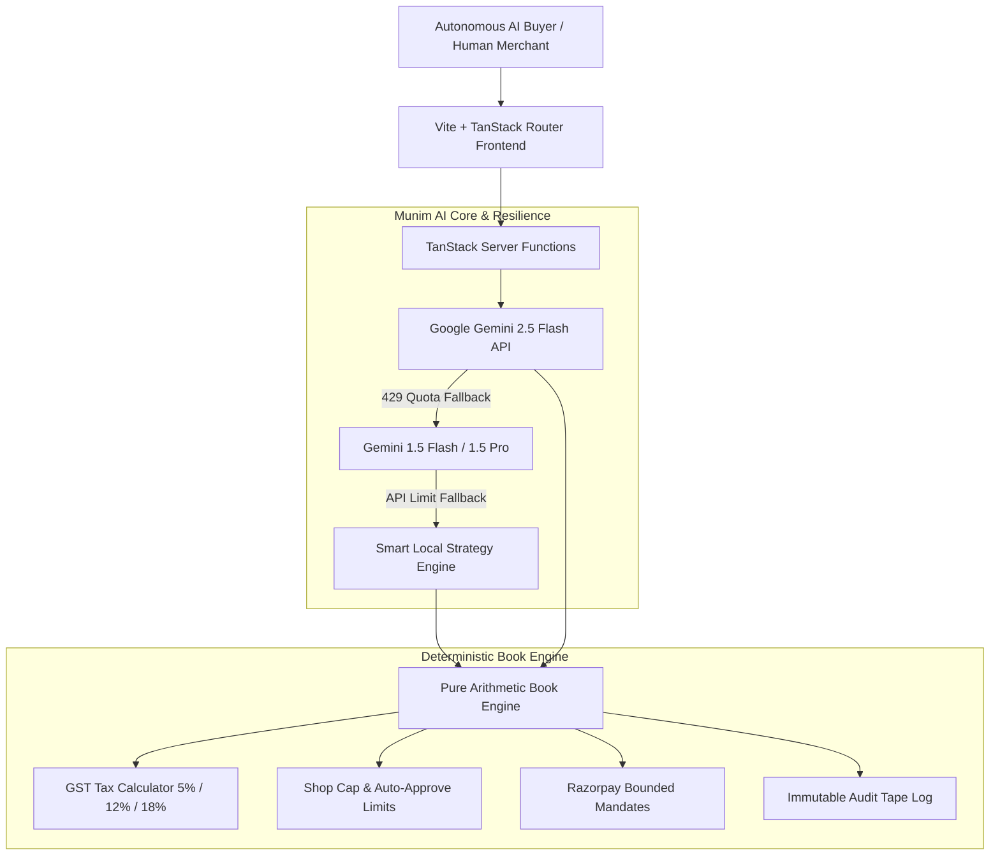
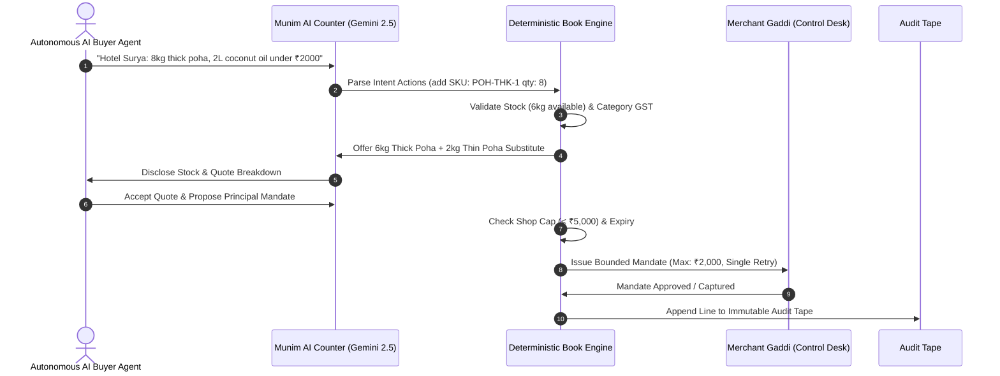
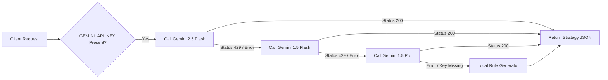

# Munim — Agentic Commerce & Bounded Payments Platform

<div align="center">


**Making Traditional Indian Kirana Merchants Discoverable & Transactable to Autonomous AI Buyer Agents End-to-End.**

*Merchant Context: Guptaji & Sons · 14 Fraser Road, Patna, Bihar (Est. 1978)*

</div>

---

## 📌 Executive Summary

While modern fintech treats agentic commerce primarily as a payment problem, for millions of traditional Indian Kiranas it is fundamentally a **visibility and description problem**. 

A merchant already takes UPI. However, when an autonomous AI procurement agent searches for *"8 kg thick poha under ₹2,000 for Hotel Surya's breakfast rush"*, standard payment gateways cannot tell the buyer bot whether the shelf has 6 kg or 8 kg, or verify that "poha" means thick poha.

**Munim** bridges 46 years of traditional Indian shopkeeper trust with autonomous AI commerce. It exposes machine-readable JSON aisles, an AI-powered counter assistant, bounded Razorpay-shaped payment mandates, dynamic commercial offers, and an immutable audit tape.

---

## 🌟 Key Product Features

### 🧾 1. The Counter (`/counter`)
- **Natural Language Negotiation**: Direct interaction with Munim (powered by Google Gemini 2.5 Flash) trained across 50 realistic Bihar purchasing scenarios.
- **Sticky Input Bar & Clean Paper UI**: Streamlined interface without emojis, keeping the chat input fixed at the bottom for instant access.
- **Automatic Stock Disclosures**: Transparent handling of short stock (*e.g., offering thin poha when thick poha is limited*) before asking for payment commitments.

### 🏬 2. Agent-Readable Aisle (`/aisle`)
- Dual-mode catalog exposing human-readable editorial pages alongside machine-readable JSON schema (`/api/catalog/agents`).
- Regional item aliases, pack sizes, stock counts, and category GST rates (5%, 12%, 18%).

### 🏛️ 3. The Gaddi Desk (`/gaddi`)
- **Merchant Control Room**: Set auto-approve ceilings (< ₹5,000), single-order shop caps, and payment failure trip switches.
- **Immutable Audit Tape**: Real-time line-by-line logging of every quote, mandate approval, capture, and warning.

### 🏷️ 4. Commercial Offers Orchestrator (`/offers`)
- **Customer Acquisition Engine**: Configure and deploy dynamic B2B passes (*Chhath Puja Mahaparv Deal, Hotel Morning Refill, Dhaba Kitchen Saver*).
- **Gemini Strategy Assistant**: Converts natural merchant goals into structured offer rules, discount tiers, and channel distribution rules.

### 🛡️ 5. Zero-Hallucination Book Engine
- **Decoupled Financial Arithmetic**: Money math is NEVER trusted to the LLM. The AI handles natural language intent mapping, while a deterministic, pure-function Book Engine computes item totals, GST subtotals, stock caps, and bounded mandates.

---

## 🏗️ System Architecture & Diagrams

### 1. High-Level Architecture



---

### 2. Transaction & Bounded Payment Sequence



---

### 3. Resilience & Multi-Model Cascade



---

## 🛠️ Technology Stack

| Layer | Technology | Key Usage |
|---|---|---|
| **Frontend UI** | React 19, TypeScript, Vite 8 | High-performance single page client application |
| **Routing & SSR** | TanStack Router, TanStack Start | Type-safe file-based routing and server functions |
| **Styling** | Vanilla CSS, Tailwind CSS | Curated paper & ink editorial aesthetic (`bg-paper`, `bg-paper-2`, `text-ink`) |
| **State Management** | Zustand, React Hooks | Reactive client state and counter persistence |
| **AI Intelligence** | Google Gemini 2.5 Flash API | Natural language intent mapping & offer strategy generation |
| **Resilience** | Custom Multi-Model Cascade | Automatic fallback across Gemini models + Local Rule Engine |
| **Backend API** | Spring Boot 3.3.4, Java 17 | REST API backend and PostgreSQL database integration |

---

## 📂 Project Directory Structure

```
munim-agentic-commerce/
├── frontend/                     # Frontend Application (Vite + React 19)
│   ├── src/
│   │   ├── components/           # UI components & SiteShell layout
│   │   ├── lib/                  # Core engines & AI server functions
│   │   │   ├── ai.ts             # Gemini 2.5 API integration & model cascade
│   │   │   ├── catalog.ts        # Product catalog & Patna dry-good SKUs
│   │   │   ├── offers.ts         # Commercial offers data engine
│   │   │   ├── store.ts          # Deterministic Book Engine state
│   │   │   └── utils.ts          # Currency, GST, and date formatters
│   │   ├── routes/               # Page routes (TanStack Router)
│   │   │   ├── index.tsx         # The Book (Home page)
│   │   │   ├── aisle.tsx         # Agent-readable aisle catalog
│   │   │   ├── counter.tsx       # Live AI Counter chat & 50 scenarios
│   │   │   ├── gaddi.tsx         # Merchant Gaddi desk & audit tape
│   │   │   └── offers.tsx        # Commercial Offers Orchestrator
│   │   └── routeTree.gen.ts      # Generated route tree
│   ├── .env                      # API keys (GEMINI_API_KEY)
│   └── package.json              # Project dependencies
├── backend/                      # Spring Boot 3 Java API
└── run-all.bat                   # Single-click launcher for Windows
```

---

## 🚀 Quick Start Guide

### Prerequisites
- **Node.js**: v18.0 or higher
- **npm**: v9.0 or higher
- **Java**: JDK 17 (optional, for Spring Boot backend)

### 1. Installation

Clone the repository and install frontend dependencies:

```bash
git clone https://github.com/alleycandy/munim-agentic-commerce.git
cd munim-agentic-commerce/frontend
npm install
```

### 2. Environment Configuration

Create a `.env` file in the `frontend/` directory and add your Google Gemini API key:

```env
GEMINI_API_KEY=your_gemini_api_key_here
```

*(Note: Get a free key at [aistudio.google.com/apikey](https://aistudio.google.com/apikey))*

### 3. Launch Development Server

Run the development server locally:

```bash
npm run dev
```

Open your browser to **[http://localhost:3005](http://localhost:3005)**.

---

## 🎯 50 Patna/Bihar Training Scenarios

Munim is pre-configured and tested across 50 purchasing situations categorized into 8 domains:

1. **Hotels & Guest Houses**: Breakfast bulk orders, thick poha stock checks, biryani basmati quotes.
2. **Dhabas & Canteens**: Highway oil refills, mustard oil tin pricing, GST breakdown invoices.
3. **Households & Regulars**: Sattu staples, Bihar jaggery, festival gifts, small household packs.
4. **Events & Festivals**: Chhath Puja prasad, Makar Sankranti tilkut, wedding catering supplies.
5. **Substitution & Stock Tests**: Transparent substitute handling for short stock items.
6. **Budget & Negotiation**: Maximizing calories and order value within tight constraints.
7. **Bulk & Commercial**: Monthly hostel and hospital supply quotes.
8. **Edge Cases**: Out-of-catalog requests, credit rejections, GSTIN validation.

---

## 📄 License & Credits

Distributed under the **MIT License**. Built for traditional merchants across Patna, Bihar and beyond.
